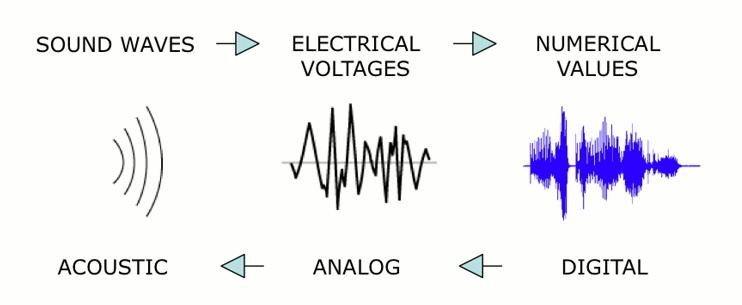

# Links Update 19.11

Anbei die Links und Bilder von den letzten Sitzungen

Violine SloMo:

[Transversalwelle on Wikipedia](https://de.wikipedia.org/wiki/Transversalwelle)

[Animationen von Wellenreflektionen (UNSW)](https://www.animations.physics.unsw.edu.au/waves-sound/travelling-waves/index.html)

[Photophon on Wikipedia](https://de.wikipedia.org/wiki/Photophon)

Hier Demos zur Chladnischen Patterns, Lissajous-Figuren etc.:

[Akustische Experimente Playlist](https://www.youtube.com/playlist?list=PLslExxbg3O-fAeclmcjO0LId_xADwxalv)

Fletcher-Munson-Kurve:

[Gehörrichtige Lautstärke on Wikipedia](https://de.wikipedia.org/wiki/Geh%C3%B6rrichtige_Lautst%C3%A4rke)

Pauken-Obertöne und mehr:

[Well-Tempered Timpani](https://wtt.pauken.org/)

Alanolg Sound Synthesis

[CV (Control Voltage)](https://synthesizeronline.com/2023/01/14/control-voltages-cv/)

Sound Localization

Sound Localization: The ability to determine the direction of a sound source relies on binaural cues:

    Interaural Time Difference (ITD): The difference in arrival time of a sound between the two ears, which is most effective for low-frequency sounds.

    Interaural Level Difference (ILD): The difference in sound pressure level reaching each ear, more pronounced for high-frequency sounds due to the head-shadow effect.

[Auditory localization: a comprehensive practical review](https://www.frontiersin.org/journals/psychology/articles/10.3389/fpsyg.2024.1408073/full)

dB

[dB@UNSW](https://www.animations.physics.unsw.edu.au/jw/dB.htm)

[3dB vs 6dB](https://audiouniversityonline.com/decibels-explained/)

Mikrofonierung

[MIkrofontypen](https://primesound.org/microphone-types/)

[Stereo-Aufnahme](https://www.sweetwater.com/insync/stereo-mic-techniques/)

[Stereo-Aufnahme DPA](https://www.dpamicrophones.com/mic-university/audio-production/stereo-recording-techniques-and-setups/)

https://de.wikipedia.org/wiki/Elektretmikrofon

[Übersicht von Shure](https://www.shure.com/damfiles/default/global/documents/publications/en/performance-production/microphone_techniques_for_live_sound_reinforcement_english.pdf-3df433145fca686a736beeb5da588efa.pdf)

Digitalisierung

https://www.waves.com/digital-audio-basics-1-what-you-need-to-know

https://docs.cycling74.com/legacy/max8/tutorials/02_mspdigitalaudio

https://www.youtube.com/watch?v=FcXZ28BX-xE

Lissajous-Figuren

https://www.eeworldonline.com/lissajous-figures-from-math-to-measurement-to-art-part-1/

https://youtu.be/xPjNPb8h8Ok?si=rHfvZri9PxfvSmY1

Dayton Miller und die ersten Wellenformaufnahmen:

https://en.wikipedia.org/wiki/Dayton_Miller

https://archive.org/details/scienceofmusical00mill/page/n7/mode/2up

Harmonic Analyzer

https://physics.case.edu/about/history/antique-physics-instruments/harmonic-analyzer-2/

https://www.youtube.com/watch?v=GyYflzRVu6M

Fourier Transform

https://www.youtube.com/watch?v=pWjdWCePgvA

https://www.nti-audio.com/en/support/know-how/fast-fourier-transform-fft

https://en.wikipedia.org/wiki/Audio_time_stretching_and_pitch_scaling

Overlap, FFT-Window, Spectral Leakage => [link](fftwindows.pdf)

Negative Frequency, Imaginary Numbers and the Complex Conjugate: https://www.youtube.com/watch?v=_3-qntJ12q4